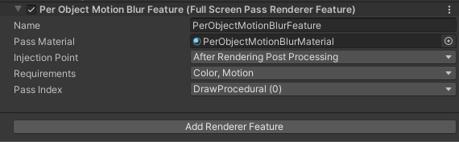
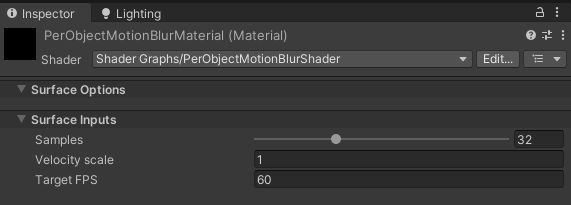

# Unity URP - Simple Per Object Motion Blur

A simple implementation of a Per-object motion blur effect for Unity's Universal Render Pipeline.
Developed as a weekend project, it uses the new _Full Screen Pass Renderer Feature_ and _Fullscreen Shader Graph_ introduced in Unity 2022.2.
This is a fullscreen effect that applies to all object using motion vectors in the scene.

## Demo

https://user-images.githubusercontent.com/34025682/212476802-2de878d8-37a8-4ddd-b1ee-240f61968056.mp4

## Instructions
* Import the "URP Simple Per Object Motion Blur" package into your Unity project.
* Add a Full Screen Pass Renderer Feature into your URP renderer.
* In the renderer feature, add a the "PerObjectMotionBlur" material provided by the package. Or use your own material.
* In the requirements, select "Color" and "Motion".

* In the material settings, you can adjust : 
  * The number of samples for the motion blur
  * The amplitude of the motion blur
  * The target frame rate / shutter speed

## Requirements
* Unity 2022.2 or later
* Universal Render Pipeline 14.0.5 or later

## Known issues
* The motion blur effect messes with the scene view in the Unity editor. I recommend to disable the effect while working in the scene view.

## Related Links
* http://john-chapman-graphics.blogspot.com/2013/01/per-object-motion-blur.html
* https://docs.unity3d.com/Packages/com.unity.render-pipelines.universal@14.0/manual/renderer-features/renderer-feature-full-screen-pass.html
* https://docs.unity3d.com/Packages/com.unity.render-pipelines.universal@14.0/manual/post-processing/post-processing-custom-effect-low-code.html
